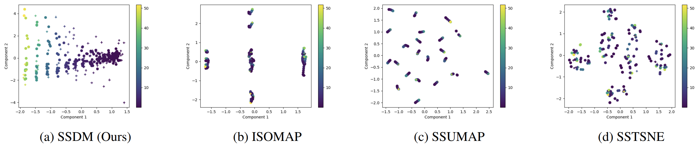
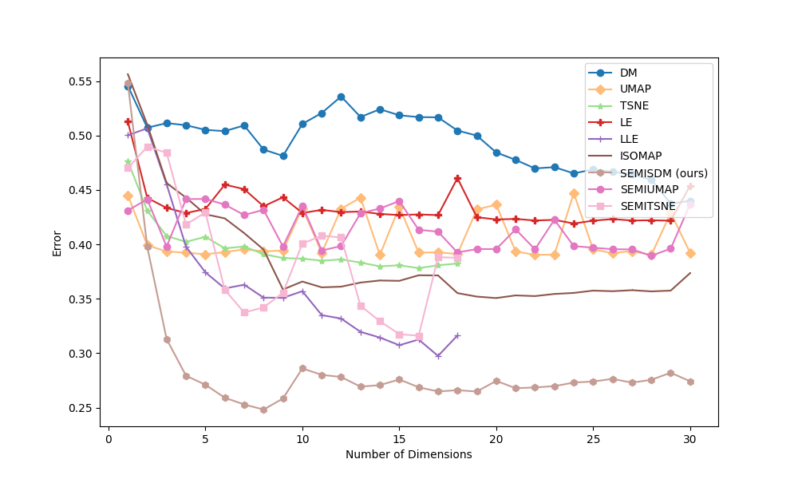

.. -*- mode: rst -*-
====
SDM
====

SDM is a novel approach that transforms the well-known
unsupervised dimension reduction algorithm, Diffusion Maps, into a supervised and semi-supervised learning tool.

More details can be found in
`our paper on xxx <https://arxiv.org/******>`_:

First author, second author, *add paper name here*

----------
Installing
----------
You can install all the required packages by executing the following command:

.. code:: bash

    pip install -r requirements_python_3_08.txt

---------------
How to use SDM
---------------

Check out the examples for using SDM with regression and classification datasets in ``supervised_regression_example.py`` and
``supervised_classification_example.py`` for the supervised setting, and ``semi_supervised_regression_example.py`` and
``semi_supervised_classification_example.py`` for the semi-supervised setting.

In general, SDM's API is similar to the well-known sklearn transformers API. For the supervised setting:

.. code:: python

    train_data, test_data, train_labels, test_labels = ...
    selected_t = 0.03  # in (0, 1)
    n_components = 2
    labels_type = 'regression'  # or 'classification'
    model = SDM(n_components=n_components, labels_type=labels_type, setting='supervised')
    sdm_train_embeddings = model.fit_transform(train_data, train_labels, t=selected_t)
    sdm_test_embeddings = model.transform(test_data, t=selected_t)

For the semi-supervised setting:

.. code:: python

    train_data, test_data, train_labels, test_labels = ...
    selected_t = 0.93  # in (0, 1)
    n_components = 2
    labels_type = 'regression'  # or 'classification'
    model = SDM(n_components=n_components, labels_type=labels_type, setting='semi-supervised')
    sdm_train_embeddings, sdm_test_embeddings = model.fit_transform(train_data, train_labels, test_data, t=selected_t)

------------------------
Examples
------------------------
Visualizations of two-dimensional data from the `Yacht Hydrodynamics dataset <https://archive.ics.uci.edu/dataset/243/yacht+hydrodynamics>`_ (continuous labels):

Supervised setting: Classification results for the
`Ionosphere dataset <https://archive.ics.uci.edu/dataset/52/ionosphere>`_: Misclassification Rate after training a
KNN on the embeddings obtained from each dimension reduction algorithm:

.. image:: images/Ionosphere_results.png
    :alt: Ionosphere_results

Semi-supervised setting: Classification results for the
`Vehicle Silhouettes dataset <https://archive.ics.uci.edu/dataset/149/statlog+vehicle+silhouettes>`_: Misclassification Rate after training a
KNN on the embeddings obtained from each dimension reduction algorithm:

