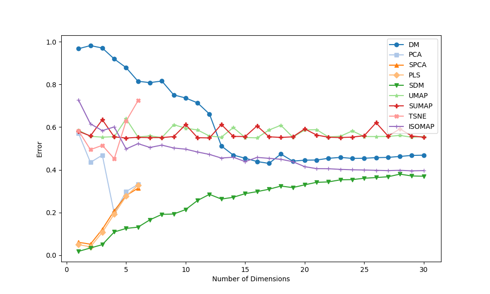
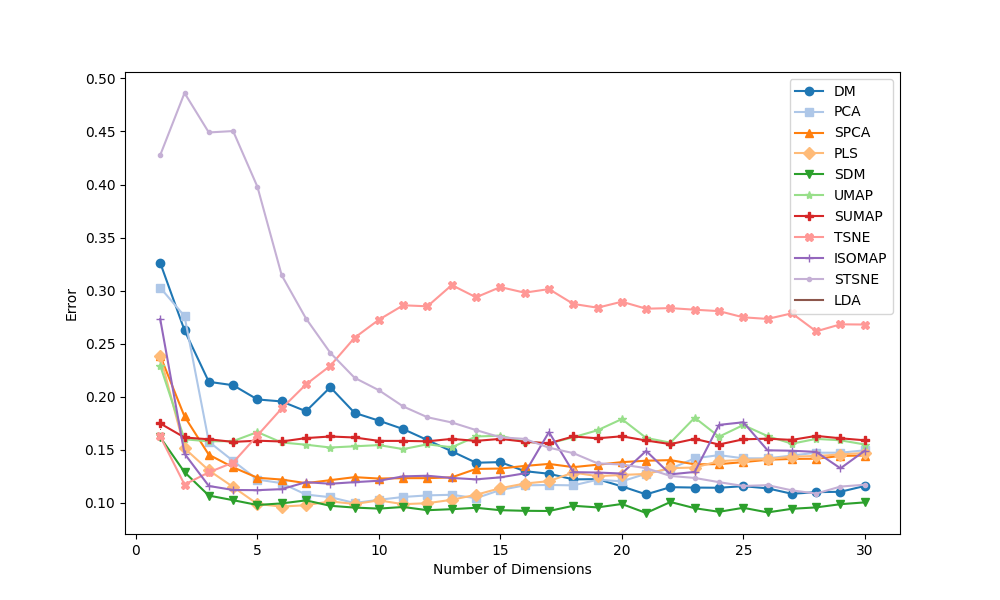

.. -*- mode: rst -*-
====
SDM
====

Supervised Diffusion Maps [SDM] is a novel approach that transforms the well-known
unsupervised dimension reduction algorithm, Diffusion Maps, into a supervised learning tool.

More details can be found in
`our paper on xxx <https://arxiv.org/******>`_:

Mendelman, H, Talmon, R, *add paper name here*

----------
Installing
----------
You can install all the required packages by executing the following command:

.. code:: bash

    pip install -r requirements_python_3_08.txt

---------------
How to use SDM
---------------

Check out the examples for using SDM with regression and classification datasets in `regression_example.py` and
`classification_example.py`.

In general, SDM's API is similar to the well-known sklearn transformers API:

.. code:: python

    train_data, test_data, train_labels, test_labels = ...
    best_t = 0.43  # in (0, 1), selected using leave-1-out on the training set
    n_components = 2
    labels_type = 'regression'  # or 'classification'
    model = SDM(n_components=n_components, labels_type=labels_type)
    sdm_train_embeddings = model.fit_transform(train_data, train_labels, t=best_t)
    sdm_test_embeddings = model.transform(test_data, t=best_t)

------------------------
Examples
------------------------
Regression results for the
`Yacht Hydrodynamics dataset <https://archive.ics.uci.edu/dataset/243/yacht+hydrodynamics>`_: Normalized Mean
Squared Error (NMSE) after training a KNN Regressor on the embeddings obtained from each
dimension reduction algorithm:

Classification results for the
`Ionosphere dataset <https://archive.ics.uci.edu/dataset/52/ionosphere>`_: Misclassification Rate after training a
KNN on the embeddings obtained from each dimension reduction algorithm:

-------
License
-------
The sdm package is 3-clause BSD licensed (to do).

